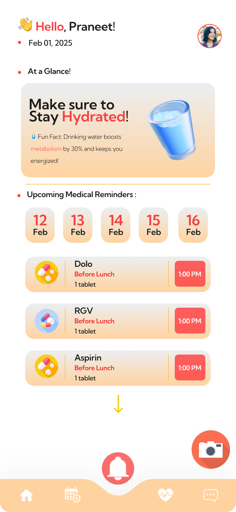

#  🧓 Vayomitra – AI-Powered Elderly Care Assistant App


An intelligent mobile app built with **React Native** to assist elderly users in health monitoring, emergency management, and daily well-being. Vayomitra leverages AI, NLP, Twilio, and Firebase to ensure safety, ease of use, and reliable communication with caregivers.

---

## 📱 Overview

**Vayomitra** is designed with empathy and modern technology to provide a digital companion for elderly individuals. Whether it’s managing medications, sending SOS alerts in emergencies, or answering queries via conversational AI — Vayomitra ensures that care is always a tap away.

---

## 🚀 Features

- ⚠️ **SOS Alert System**
  - Detects falls using wearable sensors.
  - Sends real-time **SMS alerts** with **GPS location** to emergency contacts via **Twilio API** within 5 seconds.

- 🧠 **Saya – AI Assistant**
  - Conversational AI interface to handle user queries using NLP.
  - Recommends personalized dietary suggestions based on a database of **1,000+ Indian cuisines**.

- 📸 **Prescription OCR**
  - NLP-based Optical Character Recognition with **98.7% accuracy** to extract and track medication details from scanned prescriptions.

- ⏰ **Routine Management**
  - Daily planner to manage medications and schedule.
  - Sends regular reminders to ensure consistent health and lifestyle routines.

- 🔐 **User & Caregiver Profiles**
  - Secure login/signup for elderly users and caregivers via Firebase Auth.
  - Role-based dashboard and interaction flow.

---

## 🛠️ Tech Stack

| Technology      | Description                            |
|----------------|----------------------------------------|
| React Native    | Cross-platform mobile development      |
| Firebase        | Authentication & Real-time DB          |
| Twilio API      | SMS alerts and communication services  |
| NLP (spaCy, Tesseract OCR) | Query handling & OCR processing     |
| Expo            | Rapid mobile development environment   |

---

## 📦 Installation Guide

### 1. Clone the Repository

```bash
git clone https://github.com/yourusername/vayomitra.git
cd vayomitra
```

### 2. Install Dependencies
```bash 
npm install

```
### 3. Setup Environment Variables
```bash
Create a .env file in the root directory and add your credentials:

TWILIO_ACCOUNT_SID=your_twilio_sid
TWILIO_AUTH_TOKEN=your_twilio_token
TWILIO_PHONE_NUMBER=+1234567890
RECEIVER_PHONE_NUMBER=+0987654321
EMAIL_USER=your_email
EMAIL_PASS=your_email_password
SERVER_URL=https://your-backend-api.com
```

### 4. Run the App
```bash
npx expo start
```
## 📸 App Snapshots

> 📍 Below are the UI screenshots for both **Elder** and **Caretaker** dashboards.


---

### 🧓 Elder Dashboard

| Home | AI Assistant (Saya) | Routine Manager |
|------|----------------------|------------------|
|  |  |  |

| SOS Alert | Prescription OCR |
|----------|-------------------|
|  |  |

---

### 👥 Caretaker Dashboard

| Overview | Emergency Alerts | Medication Tracking |
|----------|------------------|----------------------|
|  |  |  |

> ℹ️ Tip: Store your images in a `screenshots/` folder at the root of your project. Use optimized `.png` or `.webp` files for best performance.

---


## 📬 Contact

Yash Rathod
````
📧 yashr6577@gmail.com
